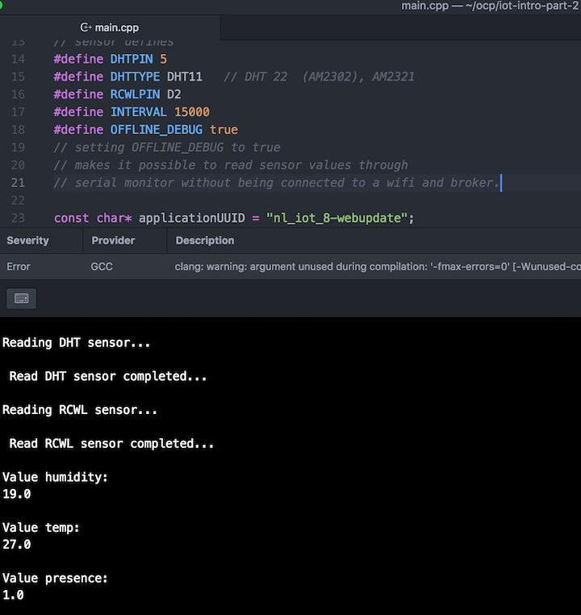

# iot-intro

## Part 2

Intro presentation to the internet of things.

ABC, SIMPLE AS 1,2,3...

## How to get started:

**DEVICE:**
 - Ensure you have [PlatformIO Core](http://docs.platformio.org/en/latest/installation.html) installed on your local machine.
 - Connect the ESP8266 to your computer using a USB cable.
 - Edit the wifi and ip-address settings in the esp8266-dht/src/main.cpp code.
 - In the esp8266-dht folder of this repo run `platformio run --target upload`.
 - This should upload the device code to the ESP8266, you should see it's led flashing during the process.


**STORAGE:**
```
docker run -d -p 8083:8083 -p 8086:8086 \
 -e PRE_CREATE_DB="wadus" \
 --expose 8090 --expose 8099 \
 --name influxdb \
 tutum/influxdb
 ```

**PRESENTATION:**
```
docker run -d -p 3000:3000 \
 --link influxdb:influxdb \
 --name grafana \
 grafana/grafana
 ```

**TRANSFORMATION:**

```
docker run -ti -p 1883:1883 -p 9001:9001 toke/mosquitto
```


```
go run mqtt-influx-bridge/main.go
```

Import the grafana dashboard from grafana.json if you are feeling lazy...

## Connecting the device to the broker

The device code is preconfigured with an SSID and a password.
These needs to be updated to match your wifi setup.

The hardware running the containers for the broker, influx and grafan need to be on the same wifi.
So that the mqtt packets from the devices can be intercepted by the broker.


## Adding a precence sensor

It is time to expand the ESP8266 with some sensors to detect precence, there are some [different alternatives](http://www.instructables.com/id/PIR-and-Radar-Sensor-Comparison/) on how to accomplish this.
We evaluated two different types of sensors:

* [PIR-sensor](https://learn.adafruit.com/pir-passive-infrared-proximity-motion-sensor?view=all)
* [Microwave-sensor](https://github.com/jdesbonnet/RCWL-0516)

We chose to use the Microwave sensor, since we easily would be able to modify it to return analogue measurements.
It is also quite easy to test the sensor by just connecting a battery and a led, since the output is a digital 1(precence) or digital 0 (no precence) and the driver can handle ~100ma

**The code in this repo will be updated with:**
* A pin dedicated for the new sensor as a digital sensor.
* A new mqtt message for precence.
* For you to do yourself: New grafana view.

## Debugging the sensors

To be able to debug the sensors, without having to connect to a Wlan or MQTT broker.
Set the variable OFFLINE_DEBUG in the code to:

`#define OFFLINE_DEBUG true`

In this mode the sensor values will only be sent over the serial port from the ESP.



*Note: We may need to filter out false positives from the data, but it is probably enough to do this from the data after it is stored in influx.*
